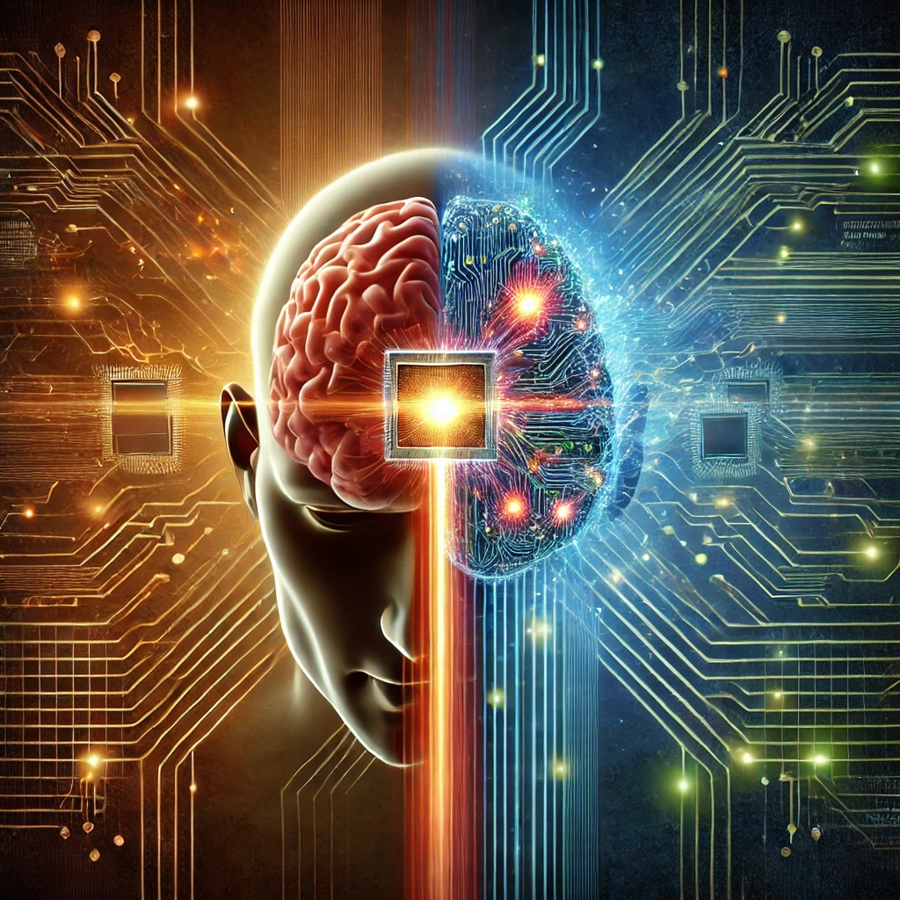

# Tecnología y Conciencia: La Analogía entre el Procesamiento Humano y el Renderizado Tecnológico

**Autor**: Alberto Buenrostro Emporo  
**Fecha**: Noviembre 2024

## Resumen

Este artículo explora la analogía entre el procesamiento de información en la tecnología digital y el procesamiento visual y cognitivo en el cerebro humano. Al igual que una computadora interpreta y renderiza código HTML para generar interfaces visuales, el cerebro humano utiliza señales neuroquímicas para interpretar estímulos visuales y crear nuestra percepción de la realidad. A través de esta comparación, se destaca cómo el desarrollo de tecnología se inspira en los procesos internos del ser humano, especialmente en la forma en que la conciencia interpreta y organiza la información.

## Introducción

A medida que la tecnología avanza, encontramos paralelismos sorprendentes entre el funcionamiento de las máquinas y los procesos biológicos del cuerpo humano. En particular, la capacidad de las computadoras para interpretar y renderizar código HTML en interfaces visuales muestra similitudes con el modo en que nuestro cerebro interpreta estímulos visuales para construir la realidad que percibimos. Esta similitud no es casual, ya que muchos de los desarrollos en el ámbito de la tecnología buscan replicar o inspirarse en procesos biológicos complejos.

Este artículo busca explorar esta analogía en profundidad, analizando los mecanismos del procesamiento visual en el cerebro y el renderizado en los sistemas digitales, destacando el impacto de estos avances en nuestra comprensión de la conciencia y su relación con la tecnología.

## Metodología

Este artículo se basa en un enfoque cualitativo que integra la revisión de literatura científica sobre los procesos biológicos relacionados con la percepción visual, junto con estudios tecnológicos sobre el renderizado digital y el procesamiento de información en computadoras. A través de una comparación conceptual, se analiza cómo los principios subyacentes en ambos sistemas, aunque distintos en naturaleza, tienen paralelismos fundamentales.

## La Analogía entre la Visión Humana y el Renderizado Web

### Procesamiento visual en el sistema humano

El procesamiento visual humano comienza cuando la luz atraviesa la córnea y pasa a través de la pupila, siendo luego refractada por el cristalino para enfocarse en la retina. En la retina, los fotorreceptores llamados conos y bastones convierten la luz en señales eléctricas, que viajan al cerebro para crear una imagen coherente.

### Proceso de renderizado de una página web

Cuando un programador escribe código en HTML, el navegador web interpreta esas instrucciones y las convierte en una estructura de objetos, lo que permite al usuario ver e interactuar con la página web.

### Comparación entre el procesamiento humano y el renderizado computacional

Ambos sistemas reciben información cruda y la transforman en representaciones significativas. El ojo convierte la luz en señales eléctricas procesadas por el cerebro, mientras que el navegador interpreta código HTML para presentarlo visualmente.

## Ambos sistemas requieren una conciencia que los interprete

Tanto el cerebro humano como las computadoras necesitan un sistema de interpretación para procesar y dar sentido a la información que reciben. El cerebro humano interpreta las señales visuales a través de la conciencia, mientras que el navegador interpreta el código para generar una interfaz visual para el usuario.

## Proyección Humana en la Tecnología

La tecnología refleja las capacidades humanas. Los lenguajes de programación como HTML permiten la creación de páginas web, las cuales imitan cómo el cerebro organiza y procesa información visual.

## Discusión sobre los Límites de la Analogía

Mientras que las computadoras procesan información de manera secuencial y objetiva, el cerebro humano introduce una dimensión subjetiva que depende de experiencias previas, emociones y contexto, lo que genera una diferencia clave entre ambos sistemas.

## Conclusión

Aunque las computadoras y el cerebro humano comparten similitudes en la forma en que procesan la información, las diferencias fundamentales, como la subjetividad de la conciencia humana, siguen siendo inalcanzables para las máquinas. La tecnología sigue siendo una extensión de las capacidades humanas, pero no puede replicar completamente la experiencia consciente.

## Referencias

1. **Koch, C., & Crick, F. (2001).** *The role of thalamocortical circuits in consciousness*. Nature Reviews Neuroscience, 2(3), 1-12.
2. **Harel, M., & Farkas, Z. (2014).** *Understanding the analogies between the brain and computers*. Journal of Cognitive Neuroscience, 26(9), 1-8.
3. **Turing, A. (1950).** *Computing machinery and intelligence*. Mind, 59(236), 433-460.
4. **Bergson, H. (1911).** *Creative Evolution*. Henry Holt and Company.
